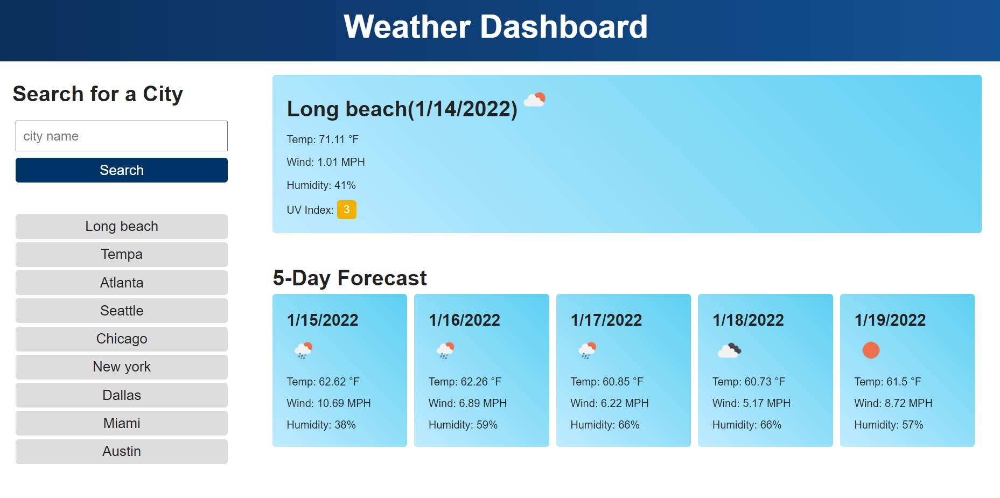

# weather-dashboard
## Description
This is a weather dashboard application. Users can see the weather outlook for multiple cities on the weather dashboard and plan a trip accordingly.

When users search for a city, the current and future conditions for that city is presented and that city is added to the search history. The current weather conditions display temperature, the humidities, UV index and so on. 
The future weather is a 5-day forcast. 

I used the OpenWeather One Call API to retrieve weather data for cities. I used localStorage to store search history.
## Links

<a href="https://yanbud.github.io/weather-dashboard/">Link to the deployed website</a>

<a href="https://github.com/Yanbud/weather-dashboard">Link to the code repository</a>

## Screenshot

